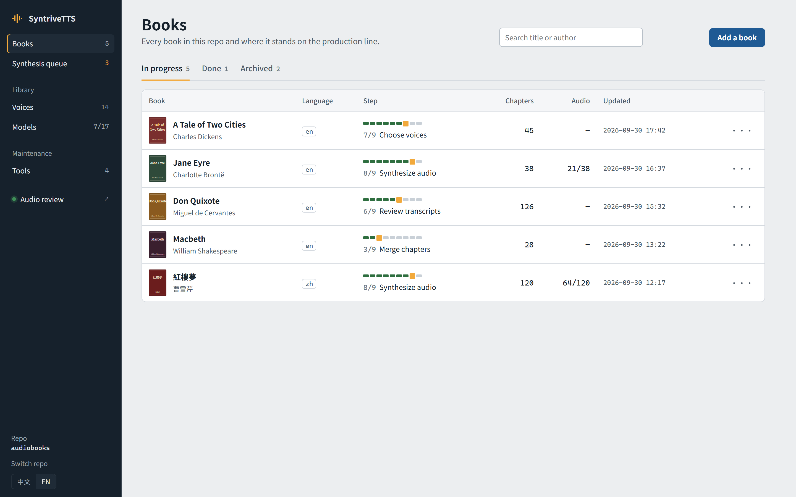
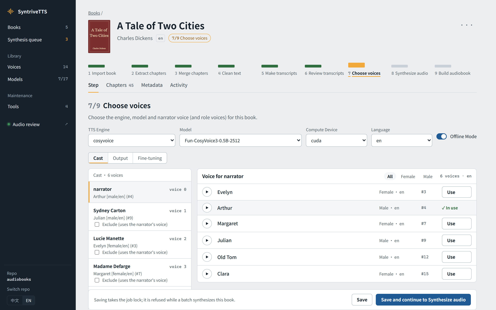
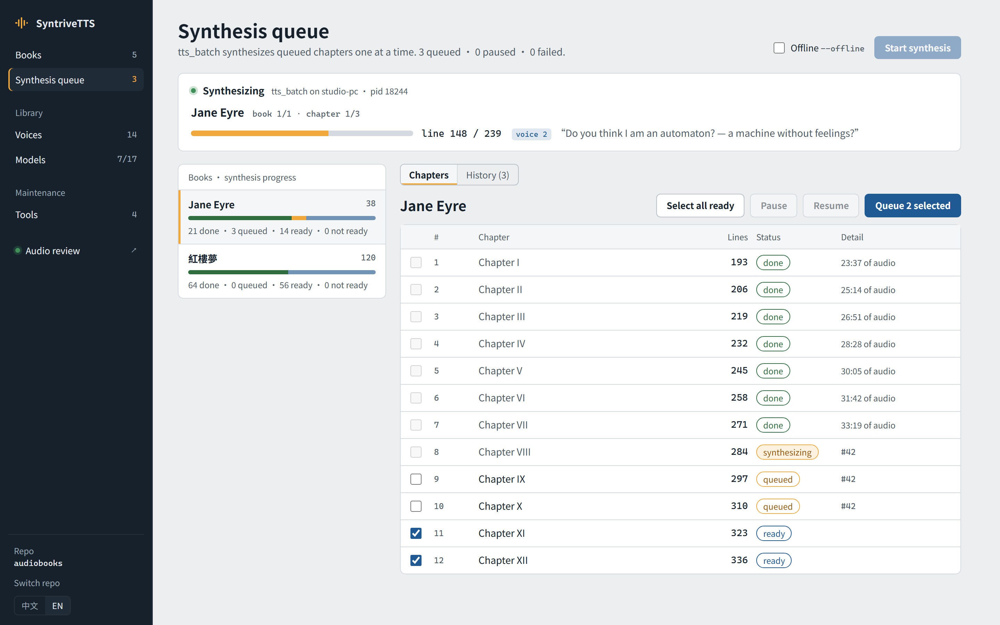
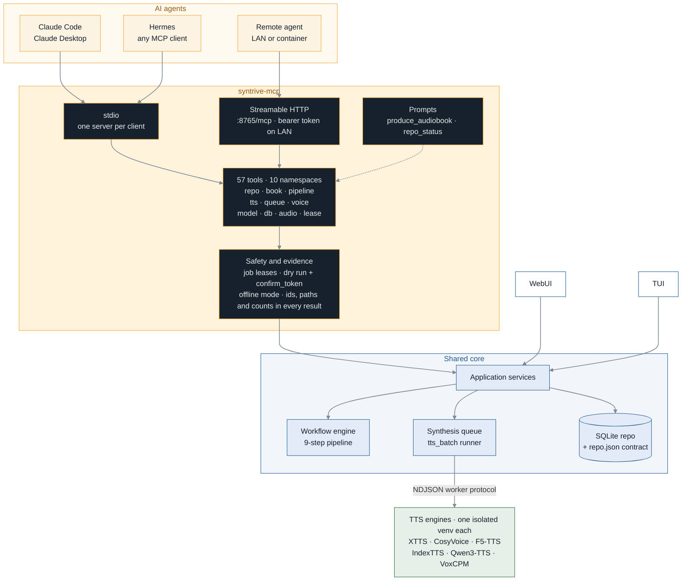
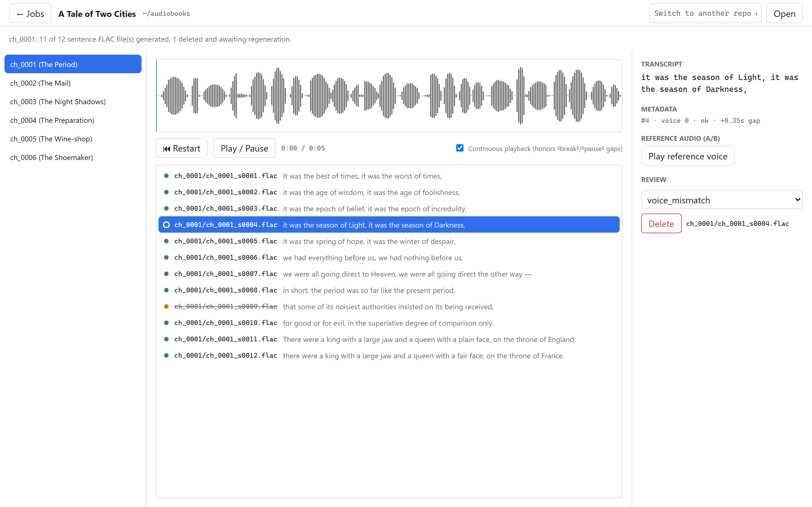
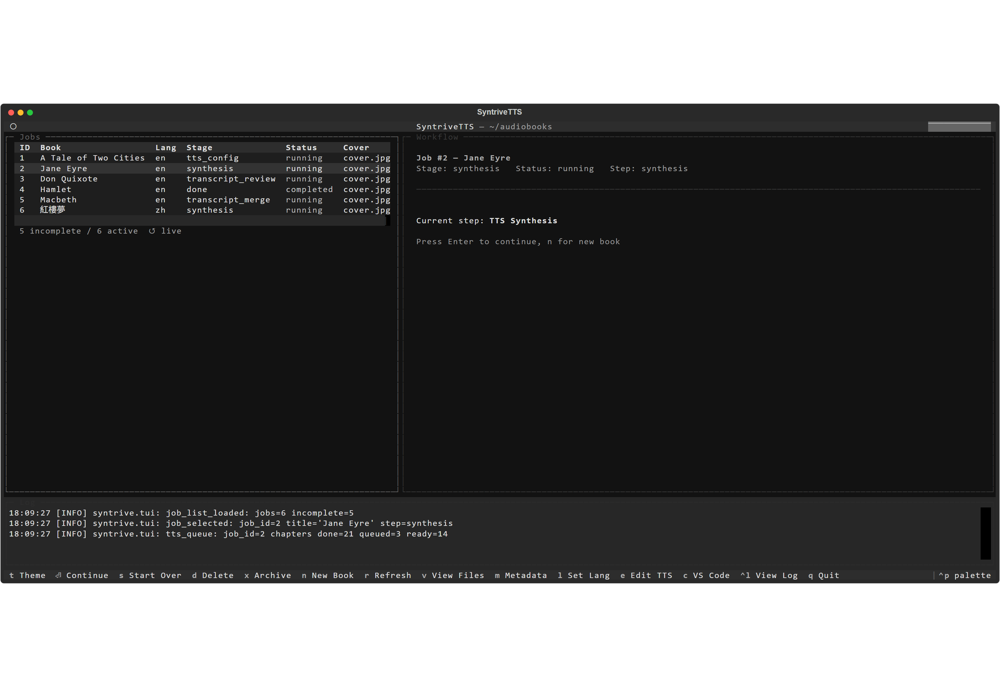
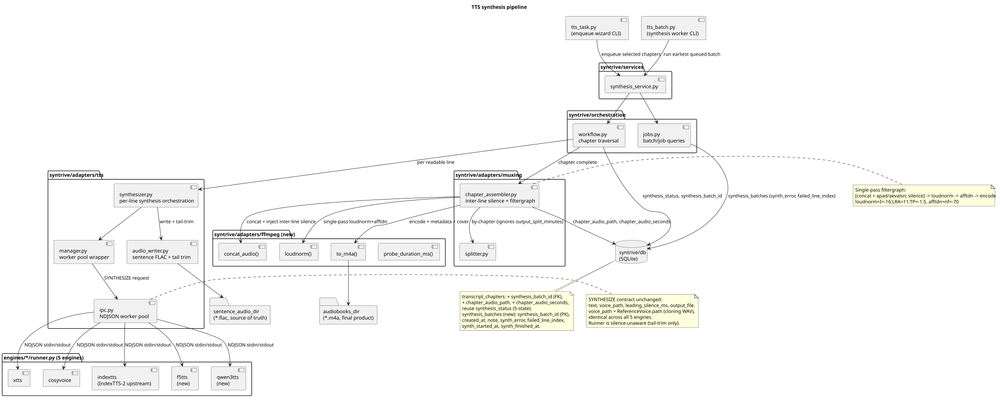
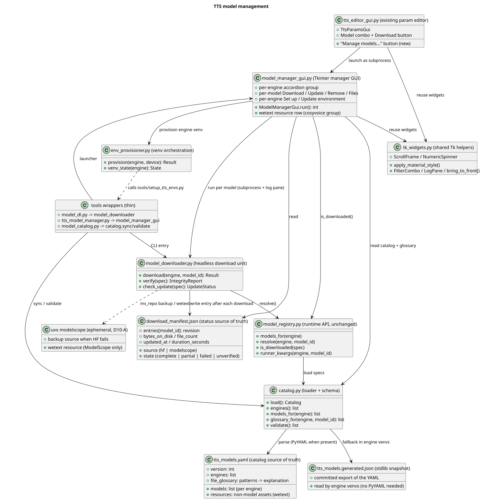
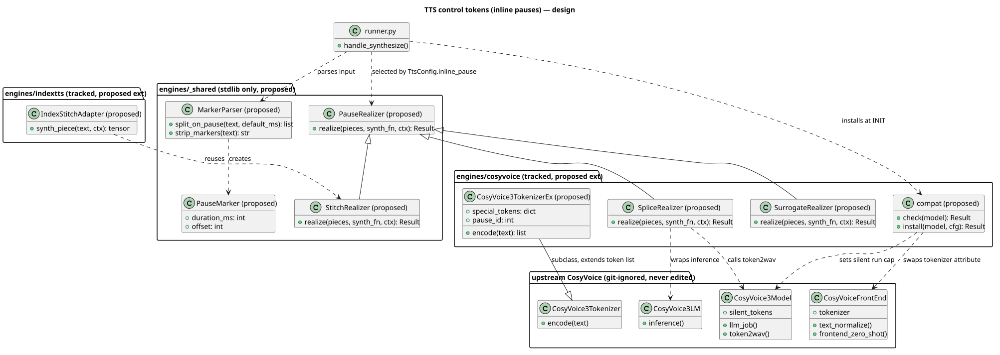

<p align="center">
  
</p>

<h1 align="center">SyntriveTTS</h1>

<p align="center">A local, multi-engine neural text-to-speech production platform. 
Human-quality narration and multi-voice casting, from full-length audiobooks to any paragraph of text — driven from a browser WebUI, an MCP server or your AI agent. A pluggable engine architecture continuously integrates, optimises and customises leading TTS models (CosyVoice, IndexTTS, VoxCPM and more) across inference and synthesis.
</p>

<p align="center">
  
  
  
  
  
  <a href="https://github.com/petercai/SyntriveTTS/stargazers"></a>
</p>

> [!IMPORTANT]
> Use SyntriveTTS only with content you have the right to convert (for books: non-DRM, legally acquired
> copies). You are responsible for how you use it and for complying with all applicable laws.

## Why SyntriveTTS

Good speech from text is still hard to produce at scale:

- Human narration sounds great but is slow and expensive per title, per video, per update.
- Cloud TTS is easy but bills per character, reads everything in one voice, and gives you little control over
  structure, pauses, or who is speaking.
- Open-source neural TTS models are now excellent — but each one is a research repo with its own dependency
  stack, and none of them is a production line.

SyntriveTTS turns those models into a production line that runs on your own machine:

- **Structured text in, finished audio out.** Text is extracted, cleaned, normalized, and split into
  speakable lines, synthesized line by line into individual audio files, then assembled with the right pauses,
  loudness, metadata, and cover art.
- **A cast, not a single voice.** Bind a cloned reference voice to the narrator and to each speaking role.
- **Six engines, one workflow.** XTTS, CosyVoice, F5-TTS, IndexTTS, Qwen3-TTS, and VoxCPM each run in their own
  isolated environment — pick per project, switch without dependency conflicts.
- **Built for volume.** A resumable queue synthesizes hundreds of chapters unattended, one GPU-safe batch at a
  time.
- **Quality control built in.** Listen to every generated line, flag the bad ones, and regenerate only those.
- **Automatable end to end.** Every capability is exposed as an MCP tool, so an AI agent — or your own
  pipeline — can run the whole flow.

## From audiobooks to any text

EPUB → audiobook is the first product built on the platform, not the limit of it.

| Stage | Status | What it adds |
| --- | --- | --- |
| **Audiobooks from EPUB** | Available | Chapter detection, cleaning, voice casting, queued synthesis, review, chaptered M4A/M4B output |
| **More source formats** | In design | Plain text, HTML, Word (`.docx`), and PDF (with a text layer) enter the same pipeline |
| **Paragraph-level speech output** | Planned | Speech for any text — not only books — delivered paragraph by paragraph, each clip with its text, voice, and timing, ready to place on a timeline |
| **Platform integration** | Planned | Use SyntriveTTS standalone, or as the voice-over engine of a text-to-speech or text-to-video platform such as [MoneyPrinterTurbo](https://github.com/harry0703/MoneyPrinterTurbo) |

The groundwork is already in place: synthesis already produces one audio file per line, each tied to its text
and voice, the MCP server can be reached over HTTP by tools running elsewhere, and each repo publishes a
machine-readable contract (`repo.json` and per-job `job.json`) that other tools read without touching the
database.

## Features

SyntriveTTS offers four front ends over one pipeline and one repo database. Use whichever fits the moment —
they share state and coordinate writes through job leases.

> Screenshots show the real UIs with demo data from public-domain books.

### WebUI — the production line in a browser

A nine-step pipeline track shows every project's position at a glance: import → extract → merge → clean →
transcripts → review → choose voices → synthesize → build. Add a book by uploading an EPUB; each step shows
what it does, what it produced, and what decision it needs.



**Cast the voices.** Pick the engine, model, compute device, and language, then bind a reference voice from
your voice library to the narrator and to each role. Preview any voice with one click before you commit.



**Watch the queue.** See the running batch live — project, chapter, line, voice, and the sentence being
spoken — and queue, pause, or resume chapters.



The WebUI also manages the **voice library** (import, tag, transcribe reference clips), **models** (download,
update, remove checkpoints and provision engine environments), and **repo tools** (export, import, voice
backup). It is available in English and Chinese.

### MCP server — let an AI agent run the studio

`syntrive-mcp` exposes the whole platform to AI agents through the [Model Context Protocol](https://modelcontextprotocol.io):
**57 tools in 10 namespaces** covering everything the WebUI can do. An agent such as Claude Code, Claude
Desktop, or Hermes can add a book, run each pipeline step, read and set the decisions, cast voices, queue and
start synthesis, and manage voices, models, and repo files — with the same validation and locks as a human in
the WebUI.



What makes it safe to hand to an agent:

- **Same core as the UIs.** Tools are thin wrappers over the services the WebUI and TUI use — no second code
  path, no shortcuts around validation.
- **Preview before anything destructive.** Destructive tools return a dry-run preview and a `confirm_token`;
  only a second call with that token executes, and a stale preview cannot authorize a different change.
- **Evidence in every result.** Each call answers with the data plus the ids, file paths, and counts the agent
  can check, and failures carry a code (`not_found`, `invalid`, `conflict`, `refused`, `failed`) with a sentence
  it can act on.
- **No collisions.** Job leases stop an agent, a person in the WebUI, and the batch runner from writing the same
  project at once; a conflict names the holder.
- **Long work stays responsive.** Pipeline steps, model downloads, and synthesis run in the background; the
  agent starts them and polls status (optionally waiting with progress notifications).
- **Ready-made workflows.** The `produce_audiobook` prompt walks an agent from an EPUB path to queued
  synthesis, stopping at each human decision; `repo_status` summarizes what is running, waiting, or failed.

Connect over **stdio** (one server per client) or **streamable HTTP** at `http://127.0.0.1:8765/mcp`, which also
serves agents on another machine or in a container (a bearer token is required off loopback). A typical
session: *"Make an audiobook from `~/ebooks/jane-eyre.epub` with the Arthur voice as narrator"* becomes
`book_add` → `pipeline_run_step` for each step → `tts_settings_save` → `queue_enqueue` →
`queue_start_runner`, with the agent reporting the evidence at each stop.

### Audio Review — line-level quality control

A split-pane review console for synthesized audio. Pick a chapter, step through its sentence files, and listen
with a waveform player; continuous playback honors the same pauses the final output uses. Compare a line
against its reference voice (A/B), tag the issue (noise, silence, voice mismatch, …), and delete bad lines —
the next batch regenerates exactly those.



### Terminal UI — keyboard-first control

A full-screen Textual app for the same pipeline: a live job list, the workflow for the selected project, and a
log pane. Continue a job with `Enter`, start over, archive, edit metadata or TTS settings, or open the project's
files — every action has a single-key binding, and light/dark themes switch with `t`.



### Also included

- **Headless batch** — `tts_task.py` queues chapters from a wizard; `tts_batch.py` runs the queue unattended and
  resumes after interruptions.
- **Portable repo contract** — each repo publishes `repo.json` and per-job `job.json` files that publishing and
  integration tools read without touching the database.

## Supported TTS engines

| Engine | Highlights |
| --- | --- |
| [XTTS](https://github.com/idiap/coqui-ai-TTS) | Coqui XTTS v2, voice cloning from a short reference clip |
| [CosyVoice](https://github.com/FunAudioLLM/CosyVoice) | Fun-CosyVoice3 and CosyVoice 2, strong Mandarin and English |
| [F5-TTS](https://github.com/SWivid/F5-TTS) | Flow-matching TTS for English and Chinese |
| [IndexTTS](https://github.com/index-tts/index-tts) | Zero-shot voice cloning |
| [Qwen3-TTS](https://github.com/QwenLM/Qwen3-TTS) | Alibaba Qwen3 speech model |
| [VoxCPM](https://github.com/OpenBMB/VoxCPM) | OpenBMB tokenizer-free TTS |

Each engine supports one or more downloadable checkpoints; the WebUI **Models** page lists them with their
download state.

## Architecture

The application is layered: the WebUI, MCP server, and TUI are presentation only and call the same services
and workflow engine; persistence is SQLAlchemy over SQLite (WAL).

**TTS engines run out of process.** Every engine lives in `engines/<name>/` with its own virtual environment,
lock file, and `runner.py` worker. The main process never imports an engine's PyTorch stack; it talks to one
resident worker at a time over an NDJSON stdin/stdout protocol, so incompatible CUDA and dependency versions
never collide.

### TTS synthesis pipeline

How queued text becomes audio: the batch CLI walks queued chapters, synthesizes line by line through the worker
pool, writes trimmed sentence FLACs, and assembles each chapter with inter-line silence and loudness
normalization.



### TTS model management

One catalog (`tts_models.yaml`, with a stdlib JSON snapshot for engine environments) drives what every engine
can load; a headless downloader verifies files and records status in a download manifest.



### TTS control tokens (design)

The proposed design for inline control tokens such as pauses: a shared marker parser splits text at pause
markers and a per-engine realizer turns them into silence, by stitching, splicing, or native tokens. Classes
marked *proposed* are not implemented yet.



## Installation

Requires Python 3.14, [uv](https://docs.astral.sh/uv/), and [FFmpeg](https://ffmpeg.org) on `PATH`. A CUDA GPU
is recommended for synthesis; CPU works for smaller jobs.

```bash
git clone https://github.com/petercai/SyntriveTTS.git
cd SyntriveTTS
uv sync                                          # main environment
```

Then provision at least one engine and download a model — from the WebUI **Models** page, through the MCP
`model_provision` / `model_download` tools, or on the command line:

```bash
python tools/setup_tts_envs.py cosyvoice --torch-device cuda   # engine venv under engines/cosyvoice/
python tools/model_dl.py --list                                # registered checkpoints
python tools/model_dl.py cosyvoice fun-cosyvoice3-0.5b         # download into models/tts/
```

## Quick Start

```bash
# WebUI: open the printed URL, then "Add a book"
uv sync --group webui
uv run python -m syntrive.webui.server -r ~/audiobooks

# MCP server for AI agents: stdio (default) or streamable HTTP on :8765
uv sync --group mcp
uv run --group mcp python -m syntrive.mcp.server -r ~/audiobooks
uv run --group mcp python -m syntrive.mcp.server -r ~/audiobooks --transport http

# Audio Review
uv sync --group player
uv run python -m audio_review.server -r ~/audiobooks

# Terminal UI: start a new book, or reopen a repo
uv run python syntrive.py -r ~/audiobooks -b book.epub
uv run python syntrive.py -r ~/audiobooks

# Headless synthesis
uv run python tts_task.py -r ~/audiobooks        # pick chapters to queue
uv run python tts_batch.py -r ~/audiobooks       # run the queue (resumable)
```

Register the MCP server with Claude Code in a project `.mcp.json` (Claude Desktop takes the same `command` and
`args` in `claude_desktop_config.json`):

```json
{
  "mcpServers": {
    "syntrive": {
      "type": "stdio",
      "command": "uv",
      "args": ["run", "--directory", "/path/to/SyntriveTTS", "--group", "mcp",
               "python", "-m", "syntrive.mcp.server", "-r", "/path/to/audiobooks"]
    }
  }
}
```

For the HTTP transport use `{"type": "http", "url": "http://127.0.0.1:8765/mcp"}` instead.

A repo (`-r`) is a folder holding `syntrivetts.db` plus one working folder per project. Set
`SYNTRIVE_TTS_OFFLINE=1` to forbid model downloads once your models are in place.

## License

SyntriveTTS follows a dual-license model:

- Free for non-commercial use: [LICENSE.txt](LICENSE.txt)
- Commercial use requires a license: contact the maintainer.

Each TTS engine and model you install is governed by its own upstream license.

## Support

If SyntriveTTS saves you time, consider supporting its development:

- Support me: <https://paypal.me/petercaica>
- Sponsor on GitHub: <https://github.com/sponsors/petercai>

## Contributing

Bug reports and feature requests are welcome via [GitHub Issues](https://github.com/petercai/SyntriveTTS/issues).

Credits: the TTS engines listed above, [FFmpeg](https://ffmpeg.org) for audio assembly,
[Textual](https://github.com/Textualize/textual) for the terminal UI, [htmx](https://htmx.org) for the WebUI,
the [MCP Python SDK](https://github.com/modelcontextprotocol/python-sdk) for the agent server, and
[wavesurfer.js](https://wavesurfer.xyz) for the review player.
